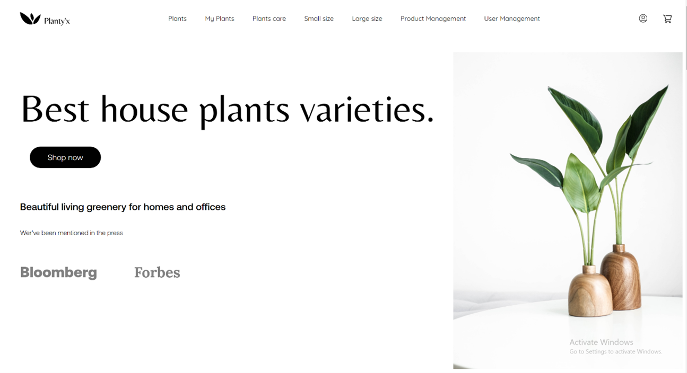
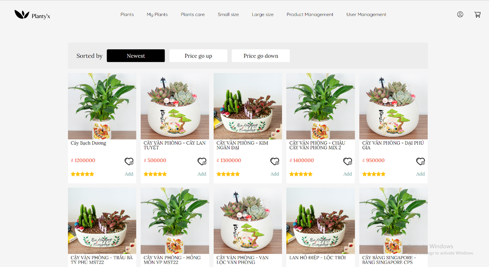

# Planty

Tree-store is a ASP .NET Core 3.1 project designed to  sell a variety of ornamental plants.

## Features

- **Feature 1**: Register, log in to become a member.
- **Feature 2**: View products and add them to cart

## Installation

To set up this project locally, follow these steps:

1. **Clone the repository**:
   ```bash
   git clone https://github.com/kita1510/Tree-store.git

## Technology
- ASP .NET Core 3.1

## Screenshot


Products list


